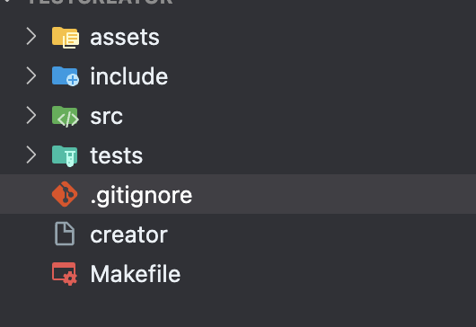

# C Project Creator

This project allows you to quickly create a C project. It runs smoothly on Windows and Linux computers

## Screenshots



## Installation

Clone repository in your machine

```bash
git clone git@github.com:OlguD/C-Project-Creator.git
```


## Run Locally

Clone the project

```bash
  git clone git@github.com:OlguD/C-Project-Creator.git
```

Go to the project directory

```bash
  cd C-Project-Creator
```

Compile project

```bash
  make
```

Create project 

```bash
  make run
```

Clean created folders

```bash
  make clean_created
```

Clean compiled project 

```bash
  make clean
```


## Authors

- [@OlguD](https://github.com/OlguD)

